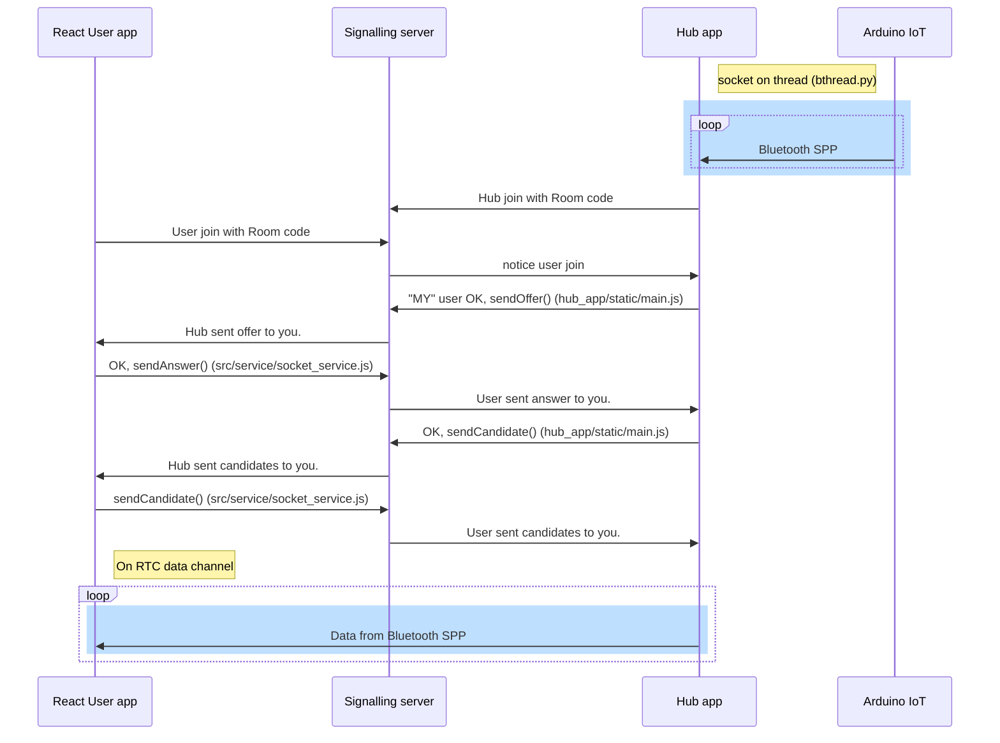
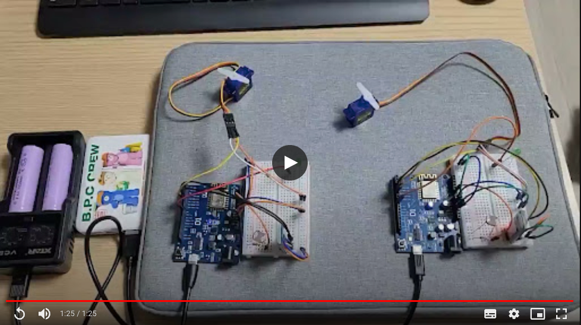

# AR Notepad, Look-it

이 레포지토리는 "기계설비 기반 SW 융합인적자원 생태계 조성사업"의 지원을 받아 진행한 연구과제임을 알립니다.

   


### 동작과정




### `$npm run server`
시그널링 서버를 동작시킵니다. `SignallingServer.js`에서 `HOST`와 `PORT`를 정의하고 있습니다.


### `hub_app $npm start`
Hub와 연결된 블루투스 장치로부터 값을 읽고, 8080 포트로 동작하는 localhost 웹 애플리케이션을 호스팅합니다.
이 애플리케이션은 Hub 장치의 웹브라우저로 열어서 Room code를 설정하는 것으로 사용합니다.

블루투스 SPP는 소켓의 형태로 추상화 되어 있으며, IoT 장비가 보내는 값을 Thread로 읽어 맵에 씁니다.
따라서 공유 변수에 접근하는 메소드는 임계영역이어야 합니다.
```python
@synchronized
def on_data_received(key, d):
    print(key, d)
    try:
        device_info[key] = json.loads(d)
    except JSONDecodeError:
        pass
    sio.emit('devices', {'devices': device_info})
```

### `$npm run start`
User app을 호스팅합니다. Hub의 소유권을 의미하는 Room code를 알고있는 사용자가 
그것을 입력하므로서 위 시퀸스 차트의 흐름이 진행됩니다.

<a href="https://drive.google.com/file/d/1M7-BiaK1IxjQ4y7lGCl_ZAyABGZhthBv/view?usp=sharing" title="Link Title"></a>